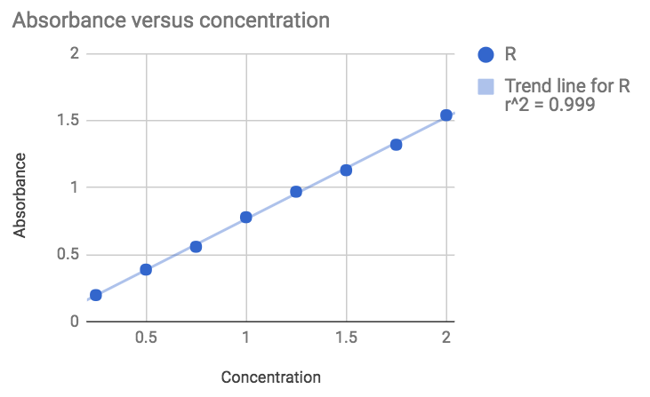
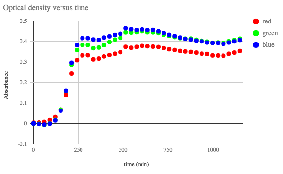
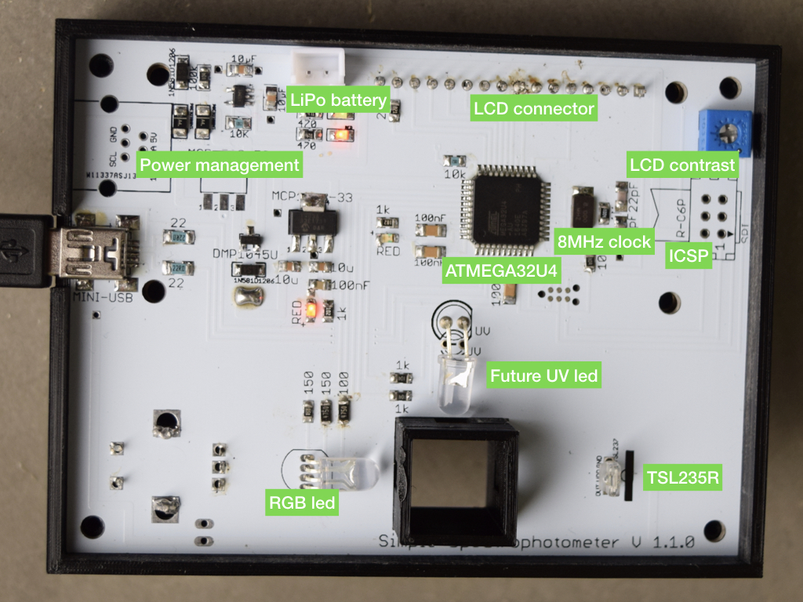

Check the full documentation on [https://hackuarium.github.io/simple-spectro/](https://hackuarium.github.io/simple-spectro/).

# DIY spectrophotometer

This project was done in the [Hackuarium](http://www.hackuarium.ch/en/) association,  a DIY biology and open laboratory situated in Renens (Switzerland). Please fee free to [contact us](mailto:hello@hackuarium.ch) if you would like more information.

The goal is to create a simple spectrophotometer that measures the
absorbance of a sample at 3 different light colors (red, green, blue), is
autonomous (on battery) and displays the result on a LCD screen.

The initial idea was that you could teach spectrophotometry without
having to buy an expensive instrument, since you can find experiments
that does not require a specific light wavelength. This includes
optical density for bacteria culture, determination of a pigments cncentration in
a solution, determination of the kinetic of a reaction and many others.

The device is rather cheap if you buy all the components on aliexpress 
(but one) and have access to a 3D printer. By constructing 10, the price
per spectrophotometer is around $30. However if you want to have a final
product with metal case and assembly, the cost would rather be $90 each if you 
order 20 of them.

## Can we do science with this ?

Before trying to explain how it is done more in detail maybe the first
question that we should answer is : can we do science with this ? When thinking about the design of the spectro, we found an electronic component that converts the light energy to frequency and that is linear on a range of nearly 10^6. Only the precision of the component is therefore really promising and shows that we could do something that gives good results.

### Patent blue V

To begin we did a very simple experiment that allows to measure the absorbance of solutions containing different known concentrations of patent blue V (E131), a blue pigment that is used in various blue candies.

The result is rather good knowing that the solutions were simply prepared by adding various volumes (0 to 2 mL) of a concentrated solution with a 1mL seringe to 100mL of water. Not the more accurate method...

### Escherichia coli

Another feature of the simple-spectrophotometer is that it works on a rechargeable battery (autonomy of 48 hours). Consequently, you can measure a kinetic even by placing the device directly inside an incubator.

Optical density (OD) at 600nm is often used in biology to determine biomass increase versus time. In this experiment we have placed Escherichia coli with cell growing media directly in the spectrophotometer cuvette and placed the spectrophotometer itself on a shaker in the incubator.
We can then program it to measure the abosrbance every X seconds. In our case we did every 30 minutes (up to 40 measures). The following curve was obtained.

This experiment clearly shows the log phase and the stationary phase. But the growth was faster than expected ... an acquisition every 15 minutes would have been a better choice.

## Using the simple spectrophotometer to teach science

The use of the spectrophotometer is rather simple. Just put a blank, press the button, wait 10s and put the sample. The result is displayed on the screen.

[Using the spectrophotometer](https://www.youtube.com/watch?v=ZfckWQn0Nws)

This device allows to understand how spectrophotometer works. As a result we used it to teah to groups of children and teenager some basic scientific concepts.

[School in Mondomo (Colombia)](https://www.youtube.com/watch?v=Be6p4-nW06k)

## How to make it ?

The design is compatible with an Arduino. We use the
ATMEGA32U4 microcontroller that is directly connected to the components we need for this spectrophotometer.

We prefer to design the full board rather than to use a shield. The extra work to add the microcontroller is rather limited so it does not make sense from our point of view to create a shield.

All the components we use but one are rather mainstream and can be found on ebay or aliexpress. The only special component  is the light to frequency converter [TSL235R](https://www.sparkfun.com/datasheets/Sensors/Imaging/TSL235R-LF.pdf)
that we buy on [Mouser website](http://www.mouser.com).

For further readings check the on-line documentation on [https://hackuarium.github.io/simple-spectro/](https://hackuarium.github.io/simple-spectro/).
