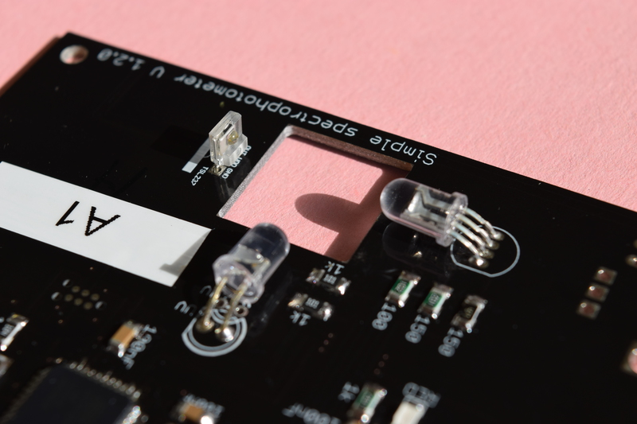
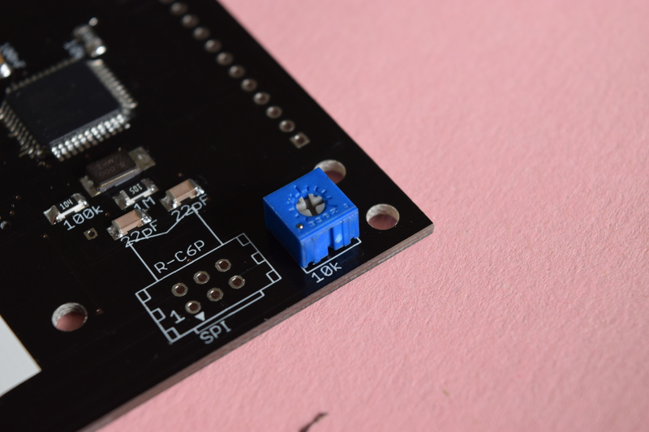
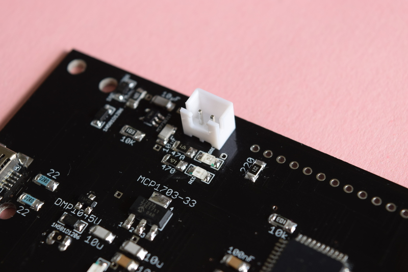
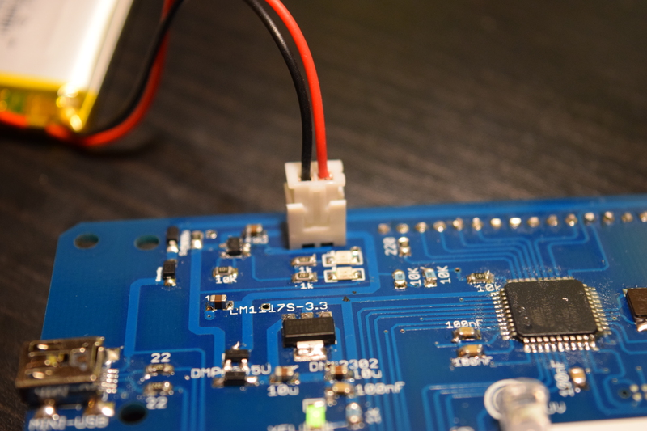
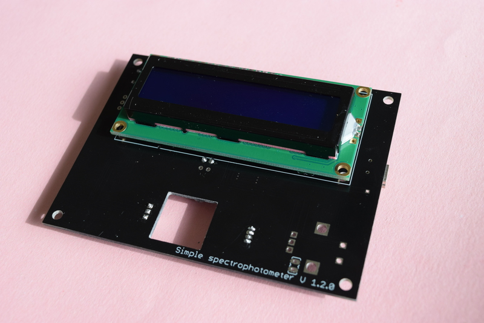
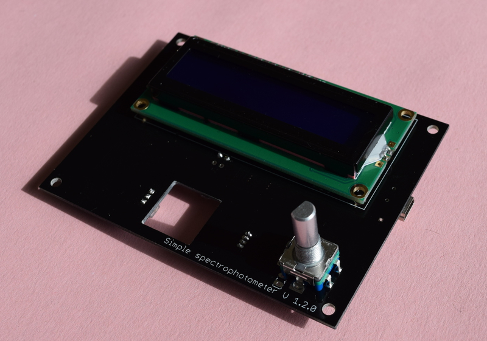

# Soldering the board

The PCB comes presoldered with all the surface mounted components.

However, all the through hole components have to be soldered by hand.

Please take care about the face on which you need to solder the components!!!!

The goal is to reach this final result:

## Bottom face

On this face we need to solder:

- Blue LED
- RGB common cathode LED
- TSL237 light to frequency convertor
- Socket for battery
- 10k potentiometer for LCD contrast tuning

### LEDs and TSL237

Please take care of the orientation of the components!
For the LEDs there is a flat side that should be oriented like the symbol printed on the board indicates.
For the light sensor (TSL237) the protrusion should points towards the RGB LED.

### Potentiometer

The potentiometer should be soldered on the bottom face of the PCB as well.

### Battery socket

The socket for the rechargeable battery must be oriented correctly. Generally, the slit points outwards.

**IMPORTANT !!! Some batteries have the connector inverted !** Please check your battery so that the red and black cables
are oriented like on the following picture.

## Upper face

The LCD is solder onto the board using a single row straight strip pin header. Is is easier to first solder the LCD screen using the smaller part of the pins.

**Note:** Finishing soldering the rotary push button and the screen may be easier if the PCB is already placed in the case. This ensures the alignment of the components.

## Rotary push button

Finally you will solder the rotary push button on the top (same as the LCD screen).

