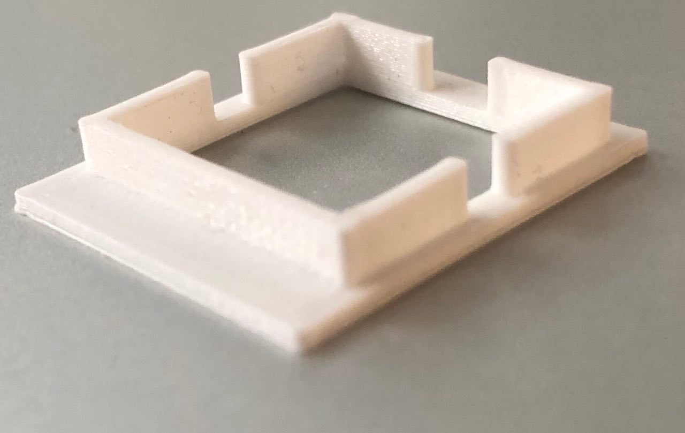

# Stability

In order to evaluate the stability of the spectrophotometer, 48 experiments were done without delay.

This experiment was repeated twice on `D1`.

The variation for RGB is less than 0.1%.

The experiment was redone using a delay of 600s between each acquisition. The main variation is probably due to temperature changes. We observe that the changes can now reach up to 0.5% and are depend on the color.

In order to confirm the importance of the temperature, the experiment was repeated with the acquisition of the temperature.

We can clearly see an inverted correlation between the red variation and the temperature.

When repeating the same experiment blank (no sample) / sample (no sample) + blank / sample, etc.

Sample 1:

- 0.54
- 0.55
- 0.54
- 0.56
- 0.56
- 0.55
- 0.55

Sample 2:

- 1.2
- 1.27
- 1.24
- 1.24
- 1.25
- 1.22

# Stability related to the cell position

When we insert / remove the cell (vary slightly the cell position), we observe the following values:

- 197474
- 191596
- 190325
- 173893
- 190822
- 201730
- 202131
- 190058
- 205585
- 186595

We observe that the orientation of the cell is critical. If we force the rotation of the cell so that it is parallel or in bias, we have the followings values:

- 229460
- 183143

Turning of 90° the cell also has a big impact depending ,I guess, on the quality of the cell. In our case (with cheap plastic ones) we observe:

- 219035
- 259780
- 215050
- 263096
- 217012
- 249061
- 213230

# Hacking of the case

It appears that when measuring the difference of absorbance between an empty tank and a tank full of water, the values were aberrants. Indeed the energy was higher with the water than without. One of the problems could be that there is a space inside the tank hole that could lead to refraction. We designed a part to hide this space using 3D printing.

We obtained theses results:

| Empty tank without part | R        | G        | B       |
| ----------------------- | -------- | -------- | ------- |
| Mean of energy          | 353033,4 | 317978,2 | 59185,9 |
| SD                      | 149,01   | 23,69    | 5,30    |

#

| Tank H2O without part | R        | G        | B       |
| --------------------- | -------- | -------- | ------- |
| Mean of energy        | 472297,8 | 421643,8 | 59170,7 |
| SD                    | 115,89   | 106,08   | 3,02    |

#

| Empty tank with part | R        | G        | B        |
| -------------------- | -------- | -------- | -------- |
| Mean of energy       | 327422,2 | 322457,5 | 397948,8 |
| SD                   | 43,81    | 28,99    | 131,21   |

#

| Tank H2O with part | R        | G        | B       |
| ------------------ | -------- | -------- | ------- |
| Mean of energy     | 414108,5 | 422623,7 | 50511,6 |
| SD                 | 53,73    | 43,92    | 33,59   |

#

#### Orientation of the part

| Test orientation with part | R      | G        | B        |
| -------------------------- | ------ | -------- | -------- |
| Mean of energy             | 61153  | 141100,7 | 177537,6 |
| SD                         | 484,21 | 1089,87  | 1050,4   |

#

| Test orientation without part | R       | G        | B        |
| ----------------------------- | ------- | -------- | -------- |
| Mean of energy                | 91207,2 | 256636,7 | 181855,8 |
| SD                            | 7635,79 | 22432,84 | 711,92   |

#

All our measures to test the influence of our part are stored here:

- [hacking of the case values](hacking_of_the_case_values)

# Test measures for UV

- [values for UV](values_for_uv)
