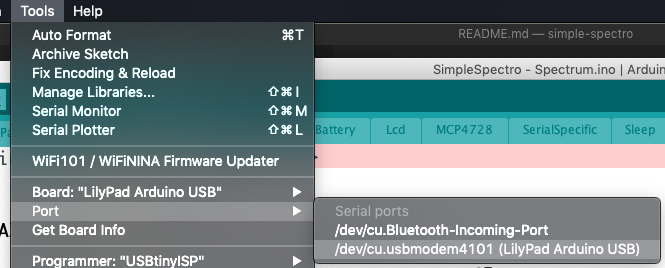
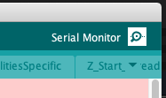
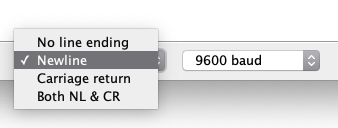

# Accessing the spectro from USB

## Connect to the spectro

It is possible to control the device from the Serial over USB. You may use for example
the command `screen` in a bash, but the easiest is probably to use the Arduino program.
Indeed the spectrophotometer appears as a 'Lilipad Arduino USB'. It is critical to chose the right board to program. Indeed the spectro contains an Atmega 32U4 at 8MHz.

### To acess the data from the Arduino platform

1. Install the Arduino IDE software
2. Select 'Tools -> Board -> Lilypad Arduino USB'
3. Select 'Tools -> Port -> xxx Lilypad Arduino USB'
4. Click on Serial monitor icon (top right)
5. Select `linefeed` and `9600` in the bottom of the screen

### Select the right port

### Open the serial monitor

### Select Newline as line ending

## Controlling the device

You may now control the spectrophotometer from the keyboard. To see the available commands just enter `h` + Enter.

The instruction `s` will show you the current settings.

| Parameter | Number | Desciption                                                                                                                                                                              |
| --------- | ------ | --------------------------------------------------------------------------------------------------------------------------------------------------------------------------------------- |
| A         | 0      | Transmission sample color 1                                                                                                                                                             |
| B         | 1      | Transmission sample color 2                                                                                                                                                             |
| C         | 2      | Transmission sample color 3                                                                                                                                                             |
| D         | 3      | Transmission sample color 4                                                                                                                                                             |
| E         | 4      | Transmission sample color 5                                                                                                                                                             |
| F         | 5      | Transmission blank color 1                                                                                                                                                              |
| G         | 6      | Transmission blank color 2                                                                                                                                                              |
| H         | 7      | Transmission blank color 3                                                                                                                                                              |
| I         | 8      | Transmission blank color 4                                                                                                                                                              |
| J         | 9      | Transmission blank color 5                                                                                                                                                              |
| K         | 10     | Delay before acquisition of the blank                                                                                                                                                   |
| L         | 11     | Delay before the acquisition of the sample                                                                                                                                              |
| M         | 12     | Delay between each acquisition of a kinetic (after blank and first)                                                                                                                     |
| N         | 13     | Number of experiments for kinetic (max 240 / (number colors + 1))                                                                                                                       |
| O         | 14     | Number of the next experiment                                                                                                                                                           |
| P         | 15     | Current time waiting                                                                                                                                                                    |
| Q         | 16     | Number of acquisitions of 100ms that will be taken (default 10). This value could be reduced for fast kinetic                                                                           |
| R         | 17     | Invert the rotary button direction                                                                                                                                                      |
| S         | 18     | Battery voltage (hundredth of volt)                                                                                                                                                     |
| T         | 19     | Temperature (hundredth of degree)                                                                                                                                                       |
| V         | 21     | Active leds and other. A number between 0 and 63. Each bit represents a function (Red, Green, Blue, UV, Voltage, Temperature). 5 would correspond to Red and Blue (binary combination). |
| W         | 22     | Error                                                                                                                                                                                   |
| X         | 23     | Value of the channel that will be displayed in the result                                                                                                                               |
| Y         | 24     | Status                                                                                                                                                                                  |
| Z         | 25     | Current menu                                                                                                                                                                            |

You may change the parameters `K`, `L`, `M`, `N`, `Q`, `R`, `V` from the command line. To check a value just enter the corresponding uppercase letter (ie `N`) followed by `Enter`. To set a value, enter the new value just after the uppercase letter (ie `N20` to set 20 experiments for kinetic).

To retrieve all the data acquired in a kinetic, the easiest is use the `d` command. This will dump all the acquired data. Please beware that the data is stored in the RAM and it therefore lost when the device is not powered.

The dumped data will contain many columns. The first column corresponds to the time (in ms) since the device was turned on, the next columns correspond to all the acquired colors.
The first line corresponds to the blank and the next lines to the kinetic. The values for each column are directly proportional to the quantity of light that reaches the detector. If you want to calculate the corresponding absorbance you need to subtract to each value the corresponding value of the first row.

There is a utility that will allows to directly [convert and plot the results on-line](http://www.cheminfo.org/?viewURL=https%3A%2F%2Fcouch.cheminfo.org%2Fcheminfo-public%2F7b6eb01da45510275179c4b587bb63f0%2Fview.json&loadversion=true&fillsearch=Analyse+spectro+log) (using Google Chrome).

This device is also compatible with the project `Arduimon`, which can be used by programmers. The default qualifier is expected to be 21569. You may check the current qualifier of your device using the instruction `uq`. You may set the qualifier using `uq21569`.
