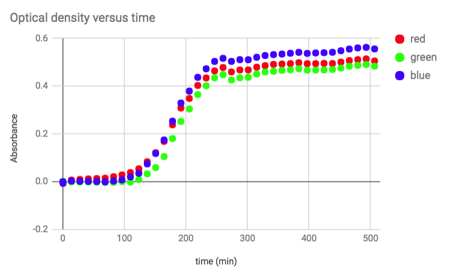
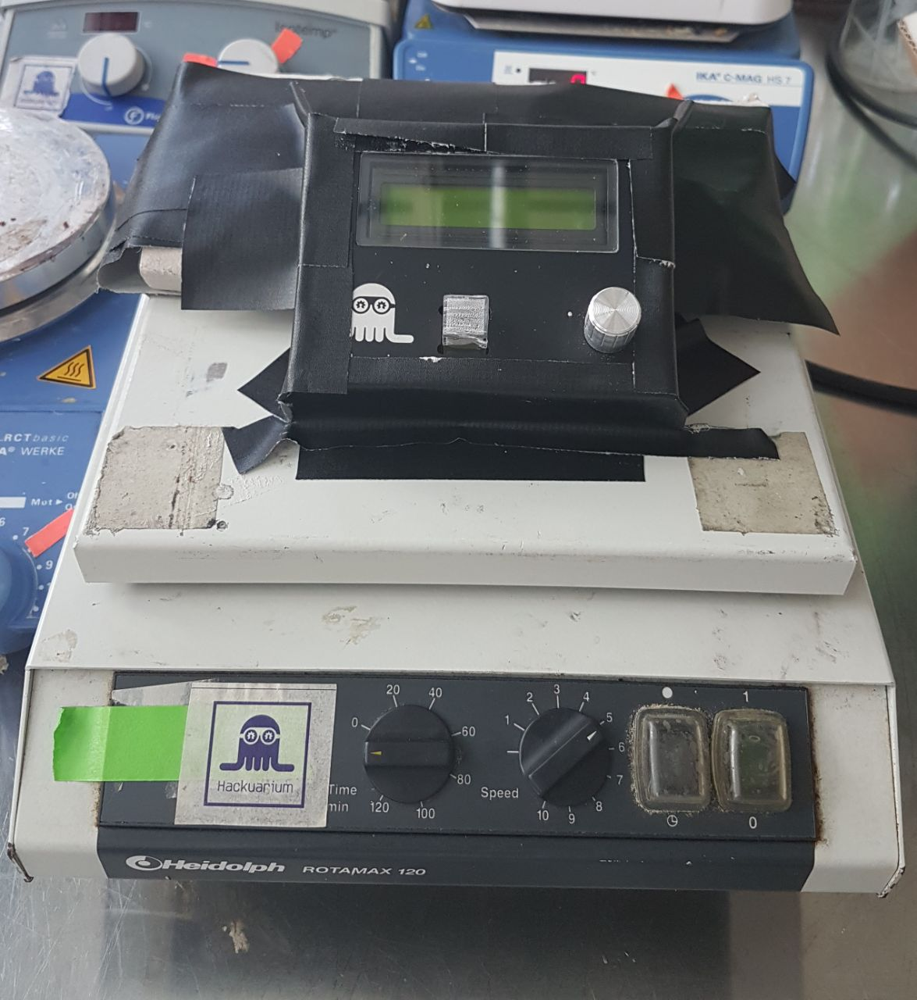
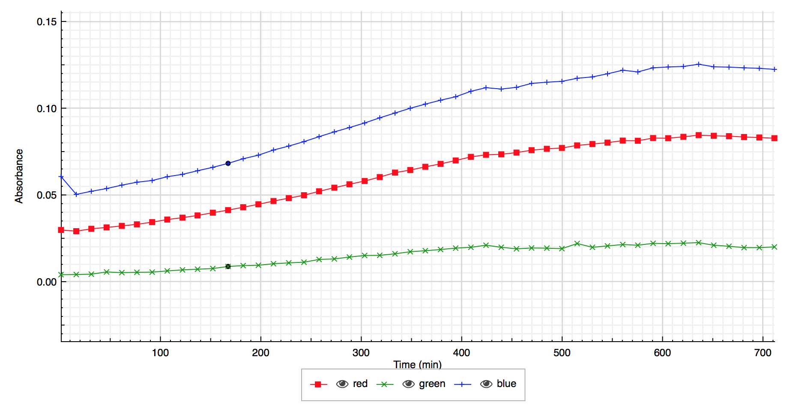
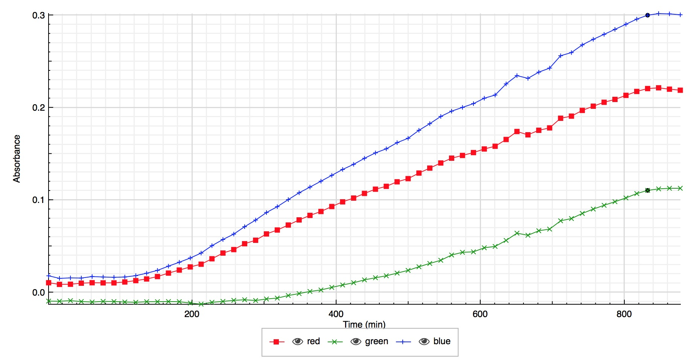
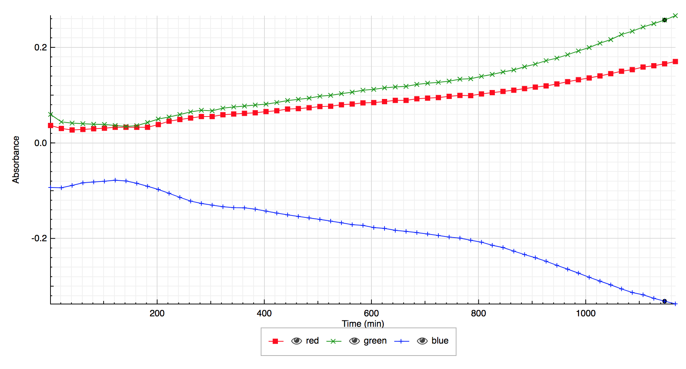
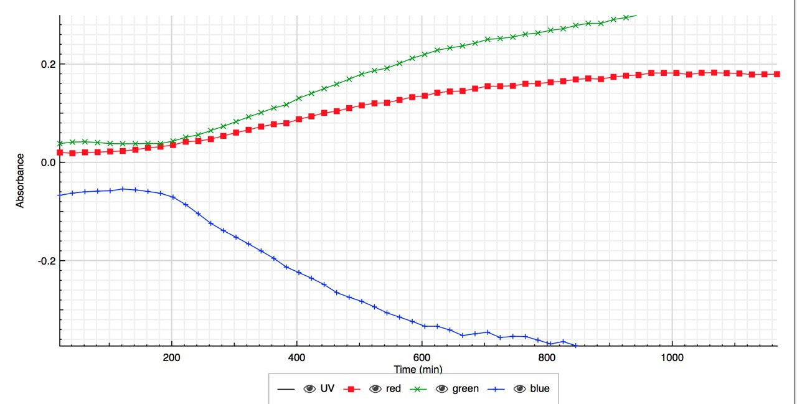

# Escherichia coli

An important feature of the simple-spectrophotometer is that it is battery-powered (autonomy of 48 hours). Consequently, you can measure a kinetic by placing the device directly inside an incubator.

Optical density (OD) at 600nm is often used in biology to determine
biomass increase versus time. In this experiment we have placed
Escherichia coli with cell growing media directly in the spectrophotometer
cell and placed the spectrophotometer itself on a shaker in the incubator.
We can then program it to measure the absorbance every X seconds. In our case
we measured it every 30 minutes (up to 40 measures). The following curve was obtained.

This experiment clearly shows the log phase and the stationary phase. But
the growth was faster than expected. An acquisition every 15 minutes
would have been a better choice.

# Rhizobium and bioluminescent bacteria Vibrio fischeri

We tried to measure the growth of other bacteria, such as Rhizobium and Vibrio fischeri. We placed the simple-spectrophotometer on a shaker (inclined), at room temperature.

- For Rhizobium, we took a measure every 15 minutes, during 12 hours. The bacteria grow at room temperature. For the blank we used only media. Then we inoculated the media and started to take measures. At the end, we obtained the following graph:

- For Vibrio fischeri, we took a measure every 15 minutes, during 14 hours and 30 minutes. The bacteria grow at room temperature. For the blank we used only media. Then we inoculated the media and started to take measures. At the end, we obtained the following graph:

# Effect of the temperature on the growth of Vibrio Fischeri

Using the simple spectrophotometer, we tried to highlight the effect of the temperature on the growth of Vibrio Fischeri. In order to study that, we put the same dispositive than above in an incubator, where the temperature has been monitored. We did 2 cultures, one at 30°C, and one at 38°C. At a higher temperature, we expect a faster growth of the bacteria. For both cultures, we used only the media as blank, and then we took one measure every 15 minutes, for 14 hours and 30 minutes. We obtained these results:

- Vibrio Fischeri culture at 30°C

- Vibrio Fischeri culture at 38°C

The results are very strange, and far from what we obtained for a culture at room temperature. Trying to explain this, we found different explanations that would be possible :

- Vibrio Fischeri is a bioluminescent bacteria. Usually, it is fluorescent only if it grows at room temperature. However, this fluorescence can explain the results we find for the blue. Indeed it emits in the blue.

- The shaker was not working very well, so maybe the cultures had not been mixed well, not allowing the bacteria to grow correctly.

- There was a problem with the simple spectrophotometer, but we can't explain what.
