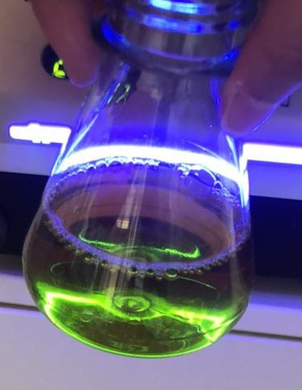

# Patent blue V

To begin we did a very simple experiment that allows to measure the
absorbance of solutions containing different known concentrations of
patent blue V (E131), a blue pigment that is used in various blue
candies.

The result is rather good knowing that the solutions were simply prepared by
adding various volumes (0 to 2 mL) of a concentrated solution with a 1mL seringe to 100mL of water. Not the more accurate method...

You may check the following protocols

- [blue-patent-v](blue-patent-v)

# Detection of mercury water pollution using carbon quantum dots

In order to detect mercury, carbon quatum dots (CQDs) can be used. They are small particles of carbon (which can be homemade) that become fluorescent in presence of UV light.
The interesting part of this application is that the CQDs react differently with mercury, and that this difference can be measured using the simple-spectrophotometer.

## How to make CQDs ?

### Materials

– 14g of sucrose or fructose

– 40ml of lemon juice or 40 ml of water and 20 drops of HCl 18%

– 0.5 g of sodium bicarbonate

– a hot plate

– a magnetic stirrer

– an aluminum foil

– a beaker

– a spatula

### Procedure 

1. Mix the sucrose/ fructose with your chosen acidic solution (we used an erlenmeyer), using the magnetic agitator.
2. Heat your solution up to 250°C thanks to the hot plate, for 40 minutes until it becomes black. Be careful to cover (with the aluminum foil) and agitate your solution.
3. Pour the content in a beaker and add in two times the sodium bicarbonate (your mix will inflate).
4. If the mixture is too thick, don't esitate to add up to 10ml of water.
5. Let cool down the solution of CQDs.

To use the CQDs, you will have to dilute them (for more precise quantities, please wait, work in progress...!)

- [CQDs-attempts](cqds-attempts)

## Test of fluorescence

Using the simple-spectrophotometer, we tested for the reaction of CQDs when exposed to UV light, while the particles were diluted in water. We used water as blank, and test for different concentration of CQDs (1, 3 or 5 drops per tank). We obtained those results:

### One drop of CQDs
|  MEAN |Blank    |Energy  |Absorbance |    |SD   |Blank    |Energy  |Absorbance
|-------|---------|--------|----------|-----|-----|---------|--------|------
|R      |395119,3 |368277,9|0,031      |    |     |5418,35  |7564,05 |0,011
|G      |419962,1 |293356,4|0,157      |    |     |1908,28  |16532,62|0,027
|B      |473191,5 |217507,5|0,34       |    |     |4166,15  |25876,94|0,055
|UV     |6548,1   |4920,6  |0,124      |    |     |179,36   |224,38  |0,020

### Three drops of CQDs

|  MEAN |Blank    |Energy  |Absorbance |   |SD  |Blank   |Energy  |Absorbance
|-------|---------|--------|-----------|---|----|--------|--------|------
|R      |389990,3 |296282,5|0,115      |   |    |6210,02 |12258,36|0,027
|G      |415605,1 |147389,4|0,457      |   |    |11265,94|17618,44|0,052
|B      |476379   |49219,3 |0,997      |   |    |5033,65 |12225,96|0,11
|UV     |6683,5   |4221    |0,2        |   |    |170,83  |147,41  |0,019

### Five drops of CQDs

|  MEAN |Blank    |Energy  |Absorbance |   |SD  |Blank   |Energy  |Absorbance
|-------|---------|--------|-----------|---|----|--------|--------|------
|R      |391031,3 |241988,8|0,209      |   |    |5801,56 |10126,13|0,024
|G      |418085,4 |78945,4 |0,73       |   |    |7647,39 |10989,91|0,062
|B      |468810,2 |13237,1 |1,57       |   |    |18055,30|3902,91 |0,12
|UV     |6912,3   |4021,5  |0,234      |   |    |202,21  |123,86  |0,016

# Determination of the pH using red cabbage
The color of the red cabbage highly depends on the acidity. We are trying to determine if it is possible to create a model with the simple-spectrophotometer to allow the users to estimate easily the pH of their solution.

## How to create your red cabbage solution ?

####  materials
– 500g of red cabbage

#### procedure
1. Cut your red cabbage in small pieces.
2. Boil it in 1L of tap water.
3. Collect the juice and store it in the fridge.

We are trying to create a precise procedure to use it, for the moment you can see the results of our attempts:

- [pH-determination-attempts](pH-attempts)