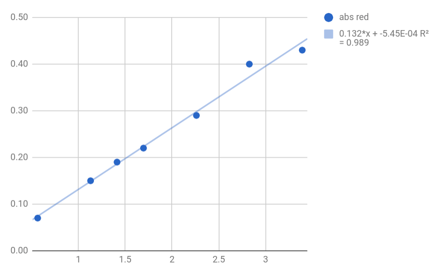

# Determination of patent blue V in Trolli sharks

We make an initial solution that contains:

13 mg of pigment in 23 mL of water.

From this solution we prepare the following dilutions:

| solution | volume of initial solution [mL] | volume of water [mL] | concentration [ng / mL] | abs red | abs green | abs blue |
| -------- | ------------------------------- | -------------------- | ----------------------- | ------- | --------- | -------- |
| 1        | 0.02                            | 20                   | 0.5652                  | 0.07    | 0.02      | 0.00     |
| 2        | 0.04                            | 20                   | 1.1304                  | 0.15    | 0.02      | 0.00     |
| 3        | 0.05                            | 20                   | 1.4130                  | 0.19    | 0.02      | 0.00     |
| 4        | 0.06                            | 20                   | 1.6956                  | 0.22    | 0.02      | 0.01     |
| 5        | 0.08                            | 20                   | 2.2608                  | 0.29    | 0.03      | 0.00     |
| 6        | 0.1                             | 20                   | 2.8260                  | 0.40    | 0.04      | 0.00     |
| 7        | 0.12                            | 20                   | 3.3913                  | 0.43    | 0.04      | 0.00     |

## Trolli sharks

The blue part of the Trolli shark weights 5.100g. We have dissolves 1.53g of that part in hot water. We obtain a final volume of 40.6mL.

Based on a linear regression of our calibration curve we have determined that each candy contains 0.186 µg of blue patent V. This means that 5g of pigment is enough to pigment over 27 millions of sharks.
