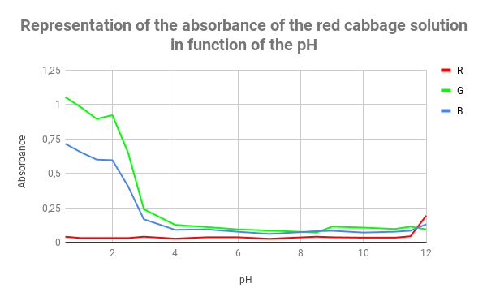
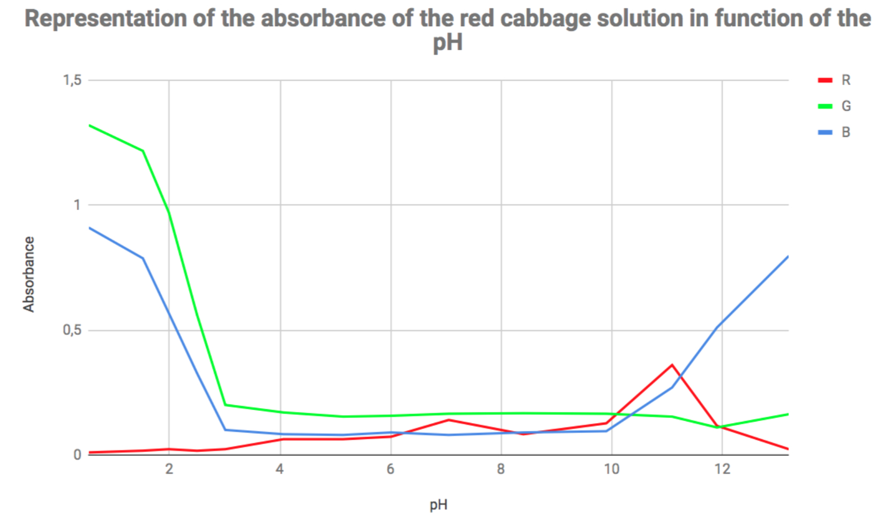

# pH determination attempts

## First try
To start, we needed values for different pH solution, we had:

- 1 solution of HCl 18% 
- 1 solution of NaOH 1M
- pH paper

From these we made 12 solutions from pH 1 to 10, 12 and 14, add 4ml of each solution in tanks and add 10 drops of red cabbage in each tank.

NB: from each initial solution we filled as many as possible tanks to obtain means of absorption. We obtained from 3 to 8 tanks for each pH. 

If you want to see all these measures, please look at:
- [absorbance-values-for-red-cabbage](absorbance-values)

## Second try

Using the same stock solutions as before, and a pH-meter, we were able to make different solutions, with a precise pH. In each tank, we put 4 mL of acidic or basic solution and 5 drops of red cabbage solution. Plotting the absorbance in function of the pH, we obtained the following graph:

Here you can find the values we used:
- [values of the graph](graph-values)

## Third try
We made a new red cabbage solution, same concentration but this time with distilled water. In each tank we placed 4 ml of acidic or basic solution and again 5 drops of our re cabbage solution. 
Here is the plot od the absorbance in function of the pH:

Here you can find the values we used:
- [values of the third try](graph-values2)

