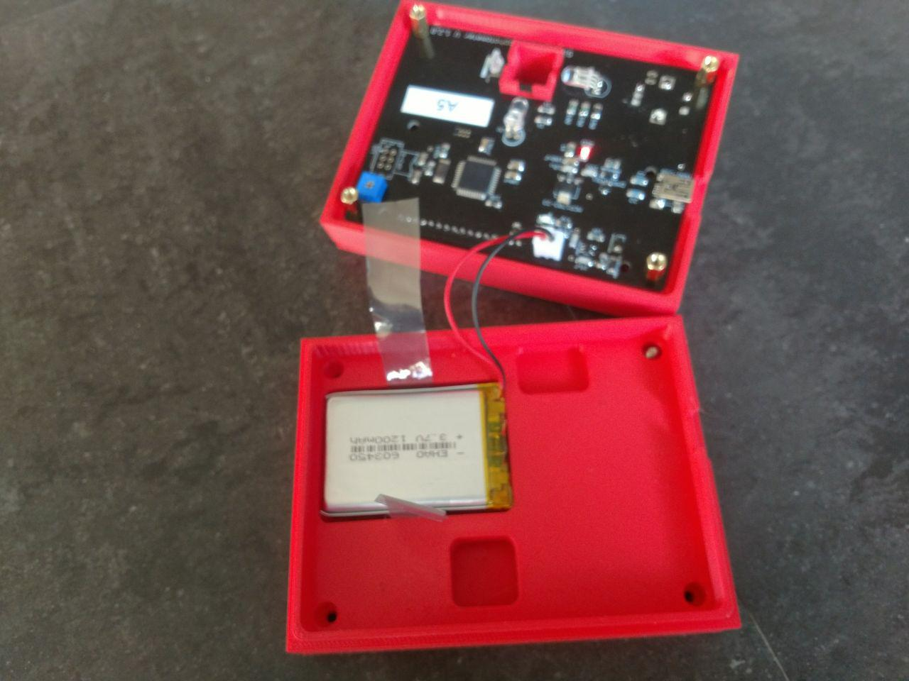
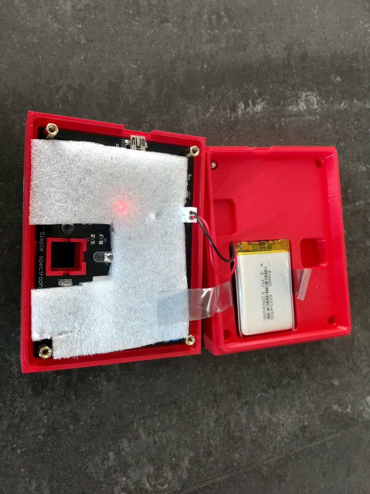

## Assembling the box

In order to prevent the battery to move it is fixed with Velcro® but to give the possibility to remove it we leave a peace of plastic under.

The PCB is fixed using brass standoff spacer (16mm - 10mm M3)

A foam of 3mm is placed in order to prevent the potentiometer to touch the battery and damage it. This was observed under heavy shaking in an incubator.

Finally the bottom is fixed to the top using 4 x M3 screws of 12mm.

## Details of the screws

### Standoff spacer

### Screw

